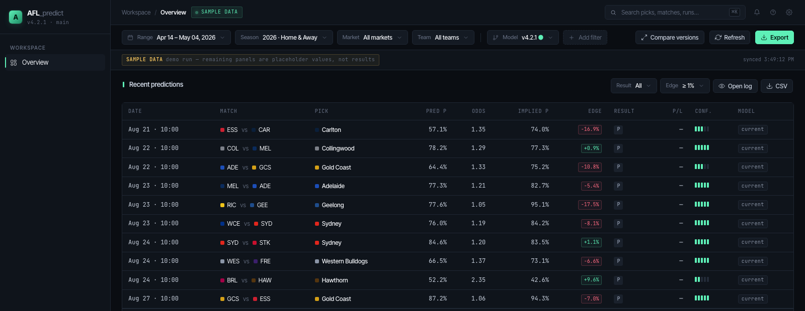

# AFL Predict

**An end-to-end machine-learning AFL forecasting and paper-trading research platform.**

> This repository performs **analytics and paper trading only**. It contains no
> automated real-money betting execution, holds no bookmaker credentials, and
> has no code path that places a wager.

[](https://github.com/EdwardH-jedi/AFL_predict/actions/workflows/ci.yml)




*Output of `make demo`: for each match in a held-out round, the ensemble's
probability, the market's implied probability, and the resulting edge. **Every
row in the table comes from the demo run**; the filter bar above it is static
chrome from the design handoff. [Asset notes](docs/assets/README.md) list exactly
which parts of this dashboard are data and which are placeholder.*

---

## What it does

- **Collects** AFL fixtures, results, bookmaker odds, weather and player
  availability from public APIs, snapshotting every raw response before parsing
- **Builds leakage-safe pre-match features** — Elo, rolling form, momentum,
  head-to-head, venue, rest, interstate travel, weather, market prices — where
  every value is provably computable before kickoff
- **Trains five probabilistic models** — Elo, logistic regression, XGBoost,
  a Poisson score-distribution baseline, and a bookmaker-consensus benchmark
- **Calibrates** forecasts with out-of-sample isotonic regression, because stake
  size depends on the probability being right, not just the ranking
- **Ensembles** them under a single authoritative weight configuration
- **Evaluates** with expanding-window walk-forward backtesting, asserting
  temporal ordering rather than assuming it
- **Identifies paper-trading value** where the model disagrees with the market,
  sized by Kelly with a hard cap
- **Tracks settlement**, bankroll, drawdown, closing-line value and calibration
  drift over time
- **Exposes** everything through FastAPI endpoints and a dashboard
- **Runs on a schedule**, with retries, hard-dependency gating, and per-job audit
  records

---

## Architecture

```text
  Squiggle API · The Odds API · Open-Meteo
                    │
                    ▼
  collectors/       collect → parse → validate → transform → upsert
                    │
                    ▼
  db/               PostgreSQL / SQLite  (SQLAlchemy + Alembic)
                    │
                    ▼
  features/         one row per match, strictly pre-match values
                    │
        ┌───────────┴────────────┐
        ▼                        ▼
  models/                  backtesting/
  Elo · Logistic ·         expanding-window folds,
  XGBoost · Poisson ·      leakage assertions,
  Bookmaker baseline       Brier · log loss · ECE,
        │                  staking simulation
        ▼
  calibration → ensemble
        │
        ▼
  orchestration/    edge vs market → capped Kelly → paper recommendations
        │
   ┌────┴─────┬─────────────┬──────────────┐
   ▼          ▼             ▼              ▼
 FastAPI   dashboard   Discord alert   readiness · CLV
```

`orchestration/daily_pipeline.py` sequences the jobs, records each run, retries
network failures, and skips downstream work when a hard dependency fails.
Details in [`docs/architecture.md`](docs/architecture.md).

---

## Tech stack

| Layer | Technology |
|---|---|
| Language | Python 3.11 |
| API | FastAPI, Uvicorn, Pydantic v2 |
| Data | PostgreSQL / SQLite, SQLAlchemy 2.0, Alembic, pandas, NumPy, PyArrow |
| ML | scikit-learn, XGBoost, statsmodels, SciPy, SHAP |
| HTTP | httpx, requests, tenacity, BeautifulSoup |
| Frontend | React (in-browser JSX, no build step) · Vite + TypeScript for the secondary app |
| Quality | pytest, ruff, mypy, GitHub Actions |
| Ops | Discord webhooks, cron / Windows Task Scheduler, loguru |

**Which UI is canonical:** `static/quant-dashboard/` — the one screenshotted
above. It needs no build step and is what `make serve` and `python serve.py`
present. `frontend/` is a secondary Vite/TypeScript app covering the same
endpoints; `static/dashboard.html` is a superseded single-file Chart.js
dashboard kept only for reference. Start with the quant dashboard.


---

## Models

| Model | Approach | Role |
|---|---|---|
| **Bookmaker consensus** | De-vigged market implied probability | The benchmark to beat. Deliberately *not* in the ensemble — blending the market in suppresses the disagreement the system looks for. |
| **Elo** | Ratings with home advantage and between-season regression | Low-variance stabiliser. Stateless at inference. |
| **Logistic regression** | L2-regularised over 29 features | Strongest single model here. Linear generalises better than trees at this sample size. |
| **XGBoost** | Gradient-boosted trees, early stopping, SHAP | Adds a different error profile to the blend; overfits alone. |
| **Poisson** | Home/away scoring rates → score-difference distribution | Currently conditioned only on an intercept and finals status, so it predicts the same probability for every regular-season match — a global baseline, not a match-specific model. |
| **Ensemble** | Weighted average, renormalised | Weights from `Settings.ensemble_weights` — one authoritative source, read by both the recommendation job and the API. |

Full detail — feature-by-feature, calibration flow, leakage argument — in
[`docs/methodology.md`](docs/methodology.md).

---

## Evaluation

Expanding-window walk-forward, 7 test folds (2019–2025), **1,413 settled test
matches**, verified 2026-08-19. Full methodology and caveats:
[`docs/results.md`](docs/results.md).

| Model | Brier ↓ | Log loss ↓ | Accuracy ↑ | ECE ↓ |
|---|---|---|---|---|
| **Bookmaker consensus** (benchmark) | **0.1997** | **0.5811** | **68.6%** | **0.0678** |
| Logistic regression | 0.2056 | 0.5961 | 67.7% | 0.0871 |
| Ensemble (raw-component blend) | 0.2081 | 0.6033 | 67.4% | 0.0824 |
| Elo | 0.2246 | 0.6382 | 62.1% | 0.0762 |
| XGBoost | 0.2269 | 0.6649 | 65.8% | 0.1226 |
| Poisson | 0.2558 | 0.7104 | 56.8% | 0.0926 |

*Brier 0.25 = coin flip. Always picking the home team scores 56.8% on these
same 1,413 matches — which is also exactly where Poisson lands.*

**No model beats the market.** The best model lands about 3% worse than the
bookmaker consensus on Brier. The market wins all four metrics in aggregate, and
wins Brier and log loss in every individual season.

Individual models do edge it out on accuracy or calibration error in single
seasons, but those are the noisy metrics — on ~200 matches, accuracy throws the
probability away and ECE over a few bins is unstable. `docs/results.md` lists
exactly which seasons and why they are not evidence of skill.

Hyperparameters come from each model class's own defaults, not from the tuners:
the tuners search the same folds these numbers are measured on, so their output
would be selection leakage. `docs/results.md` records how an earlier, circular
version of that claim was caught and corrected.

That is the honest result and it is the expected one. AFL head-to-head markets
are liquid, and a consensus of bookmakers prices them with strictly more
information than these features carry — including team news that never reaches
the dataset. A model that *did* beat the closing consensus by a wide margin over
1,413 matches would be evidence of leakage, not skill.

**Leakage prevention** is enforced in code, not documented as an intention:
`backtesting/splits.py::_assert_no_leakage` raises `LeakageError` on any fold
where a training match kicks off after a test match; Elo emits the pre-match
rating before updating it; every rolling window filters on `match_time`;
bookmaker features require `snapshot_time < match_time`. Asserted in
`tests/test_splits.py` and `tests/test_demo.py`.

Simulated staking returns are reported in `docs/results.md` but carry heavy
caveats — the historical consensus prices have **zero bookmaker margin**, which
inflates every ROI figure. They are not presented as expected returns.

---

## Demo

No API key, no database, no network, no credentials. About 30 seconds.

```bash
git clone https://github.com/EdwardH-jedi/AFL_predict.git
cd AFL_predict
python3.11 -m venv .venv
source .venv/bin/activate          # Windows: .\.venv\Scripts\Activate.ps1
python -m pip install --upgrade pip
pip install -r requirements-dev.txt

make demo
```

`make demo` reads `examples/sample_matches.csv` (636 real completed matches,
2023–2025), holds out the last home-and-away round, trains the real models on
everything earlier, blends them with the production ensemble weights, applies the
real Kelly staking rule, and writes the dashboard payload:

```text
--------------------------------------------------------------------------
  AFL PREDICT — PORTFOLIO DEMO   (sample data · paper trading only)
--------------------------------------------------------------------------
  Sample file      examples/sample_matches.csv
  Trained on       617 completed matches (strictly earlier kickoffs)
  Holdout slate    2025 round 24 — 10 matches
  Ensemble weights {'logistic_baseline': 0.3, 'xgboost': 0.35, ...}
--------------------------------------------------------------------------
  MATCH                                  P(home)  CONF PAPER BET
--------------------------------------------------------------------------
  Essendon v Carlton                       0.428  MED  $50.00 on home @ 3.846
  Collingwood v Melbourne                  0.782  HIGH no bet (edge below threshold)
  ...
--------------------------------------------------------------------------
  Ensemble on holdout: accuracy 70.0% (7/10)  Brier 0.1559  log loss 0.4758
  Paper staking: 8 bet(s), $400.00 of a $1000 notional bankroll, 2/8 won, P&L $-12.30
--------------------------------------------------------------------------
```

Then view it in the browser:

```bash
python serve.py      # http://localhost:8080
```

The dashboard shows a `SAMPLE DATA` banner for demo payloads. Ten matches cannot
evaluate a model — [`docs/results.md`](docs/results.md) can.

> The demo replays completed matches as if they were upcoming. It is clearly
> labelled as sample data everywhere it appears and never claims to be live.

---

## Full development setup

Requires Python 3.11.

```bash
python3.11 -m venv .venv
source .venv/bin/activate
python -m pip install --upgrade pip
pip install -r requirements-dev.txt

cp .env.example .env               # defaults are local-only: SQLite, no keys
python -m alembic upgrade head     # build the schema — do this before anything else
```

Nothing above needs a credential. `ODDS_API_KEY` and Discord settings are
optional; blank values disable those jobs and the rest of the pipeline still runs.

`alembic upgrade head` is the only supported way to create the schema. `make
db-init` (`create_all`) exists for throwaway inspection and must not be mixed
with Alembic on the same database.

Then, with network access:

```bash
make ingest-afl ARGS="--season 2025"   # fixtures and results from Squiggle (free, no key)
make build-features                    # feature matrix → parquet + DB
make train-models                      # train, calibrate, record ModelRun rows
make backtest                          # walk-forward evaluation
make serve                             # FastAPI on :8000
```

`make help` lists every target. Scheduled operation, the dual-machine
deployment, and configuration reference:
[`docs/operations.md`](docs/operations.md).

---

## Testing

```bash
make test      # pytest tests/ -v          (338 tests)
make lint      # ruff check .
```

```bash
pytest tests/ -q
python -m pytest tests/test_alembic_fresh_db.py -v   # migrations on a fresh DB
python -m demo.run_demo                              # demo end to end
```

CI runs all of the above on Python 3.11 for every push and pull request, with no
credentials configured, and fails if the demo modifies a tracked file.

---

## Project status

**Portfolio release / research system.** Ingestion, feature engineering,
modelling, calibration, walk-forward evaluation, paper recommendation, the API
and scheduled operation are implemented and tested. Results are freshly verified
and reported honestly, including the finding that the models do not beat the
market.

Known limitations, stated plainly:

- No historical weather was collected, so weather features are null throughout
  the evaluation and contribute nothing to the reported results.
- Player availability features are constant, not merely approximate: every row
  is hard-coded to 1.0 with zero absences, so they contribute nothing to any
  result. Real values need a pre-match team-sheet source.
- The historical odds feed is a market consensus with no bookmaker margin, which
  makes simulated ROI structurally optimistic and CLV uncomputable on that data.
- The static dashboard is a design prototype: panels the data layer does not
  populate still display placeholder values. See
  [`docs/assets/README.md`](docs/assets/README.md).
- The accumulated paper-trading sample is not yet large enough to report CLV or
  realised ROI.
- The evaluation is inspectable but not bit-reproducible from a clean clone: the
  feature parquet is gitignored, regenerating it needs live Squiggle data that can
  be retroactively corrected, and `requirements.txt` pins ranges rather than exact
  versions. The exact result artifact is committed
  ([`examples/backtest_2026-08-19.json`](examples/backtest_2026-08-19.json)) so
  every reported number can be checked against its source.

Exploratory work on LLM-generated match previews is **out of scope for this
release**. No fine-tuning, LLM, or narrative-generation code exists in this
repository. The design notes are archived in
[`docs/archive/`](docs/archive/README.md) as a record of exploration.

---

## Documentation

| Document | Contents |
|---|---|
| [`docs/architecture.md`](docs/architecture.md) | Components, data flow, model artifact lifecycle |
| [`docs/methodology.md`](docs/methodology.md) | Features, leakage prevention, calibration, validation, metrics |
| [`docs/results.md`](docs/results.md) | Verified evaluation results and caveats |
| [`docs/operations.md`](docs/operations.md) | Scheduling, dual-machine deployment, configuration, runbooks |
| [`docs/archive/`](docs/archive/README.md) | Historical plans and superseded designs |

---

## Responsible use

**Paper trading only. No automatic real-money bet placement.**

- Every recommendation is written with `paper_trade = True`.
- `notify_bets.py` posts a Discord message. That is the entire notification path.
- `tab_tracking.py` records bets a human placed elsewhere, for audit. It holds no
  bookmaker credentials and contacts no sportsbook.
- `evaluation/live_readiness.py` reports whether accumulated evidence *would*
  support a restricted live trial. A `ready` verdict authorises nothing; there is
  no mechanism in this codebase to act on it.
- Betting carries real financial risk. Nothing here is financial advice, and the
  measured results above are a poor case for wagering money.

---

## License

MIT — see [`LICENSE`](LICENSE).
